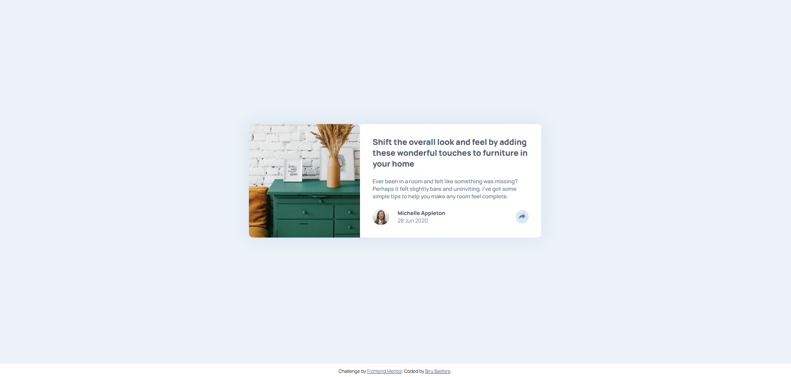

# Frontend Mentor - Article preview component solution

This is a solution to the [Article preview component challenge on Frontend Mentor](https://www.frontendmentor.io/challenges/article-preview-component-dYBN_pYFT). Frontend Mentor challenges help you improve your coding skills by building realistic projects. 

## Table of contents

- [Overview](#overview)
  - [The challenge](#the-challenge)
  - [Screenshot](#screenshot)
  - [Links](#links)
  - [Built with](#built-with)
  - [What I learned](#what-i-learned)
- [Author](#author)

## Overview

### The challenge

Users should be able to:

- View the optimal layout for the component depending on their device's screen size
- See the social media share links when they click the share icon

### Screenshot

### Links

- Solution URL: [http://127.0.0.1:3000/JavaScript/Article%20Preview%20Component/index.html]
- Live Site URL: [https://birumj.github.io/Article-Preview-Component/]

### Built with

- Semantic HTML5 markup
- CSS custom properties
- Flexbox
- Mobile-first workflow

### What I learned

In this project, I have learned the basics of displaying and hiding components with JavaScript.

## Author

- GitHub - [Biru Basfore](https://github.com/BiruMJ)
- Frontend Mentor - [@BiruMJ](https://www.frontendmentor.io/profile/BiruMJ)
- LinkedIn - [@biru-basfore-8b52262a4](www.linkedin.com/in/biru-basfore-8b52262a4)
